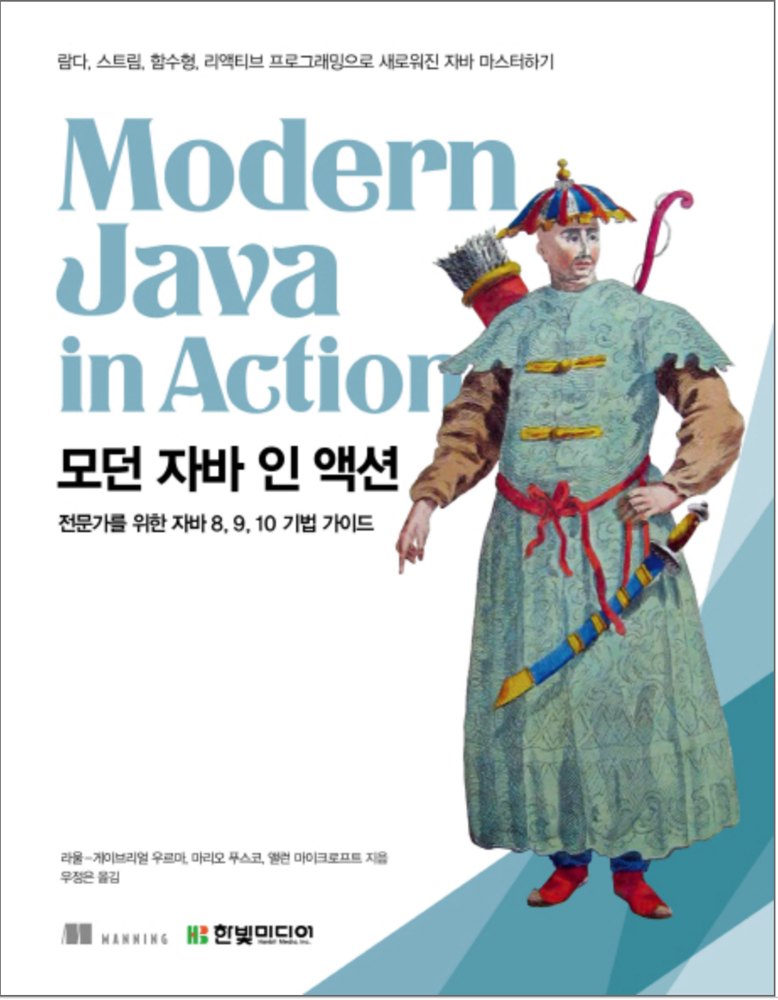

# 모던 자바 인 액션 스터디

  

## 🔥 활동 개요

1. 각 스터디 참가자는 매주 정해진 챕터를 읽어온다.
2. 각 스터디 참가자는 매주 **화요일 오전 10시까지** 해당 챕터와 관련된 문제를 1개 이상 선정하여 이슈로 등록한다.
3. 매주 **수요일 오전 11시부터 오후 12시 반까지**에 정기 모임을 가지며, 이슈로 등록된 문제들에 대해 토론하는 시간을 가진다.
4. 각 스터디원은 그 다음주 **화요일 오전 10시 까지** 모든 이슈에 대해 적어도 1개의 의견을 답변으로 단다.

## 📌 이슈

질문의 난이도는 10~15분 정도 토론할 수 있는 것으로 준비한다.

가급적 다양한 의견이 나올 수 있는 주제를 선정한다.

먼저 올린 이슈들에 대해 겹치지 않는 내용의 문제를 선정하여 이슈로 등록한다.

### 오픈소스

토론이 끝난 챕터에 대해서도 생각해볼 만한 이슈가 생각나면 자유롭게 등록할 수 있다.

스터디원 외에도 자유롭게 이슈를 생성할 수 있으며, 스터디 내 토론 활동과 별개로 답변을 통해 의견을 공유할 수 있다.

## 🗣 토론

각 정기모임은 총 4~5개의 토론이 진행된다.

각 토론은 특정 이슈를 기준으로 진행되며, 각 이슈를 등록한 스터디원이 발의자가 된다.

엄밀히 말하면 토의의 형식을 띤다. 일방적으로 발의자 vs 토론자의 구도가 되지 않도록 서로 노력한다.

### 사회자

매주 새로운 사회자를 선정한다.

사회자는 발의자를 지원자로 받고, 인원이 부족한 경우 제비뽑기로 인원을 충당한다.

사회자는 특정 토론이 15분을 넘기지 않도록 적절하게 중재한다.

사회자는 모임 중 모든 토론자들이 적어도 1회 이상의 발언권을 얻을 수 있도록 발언 기회를 분배한다.

### 발의자

발의자는 토론 시작 시점에 본인이 등록한 이슈에 대해 설명한다.

1. 문제가 무엇인가?
2. 왜 이러한 문제를 선정하였는가?
3. 자신이 생각하는 답변은 무엇인가?

모든 토론자는 제비뽑기 결과에 따라 발의자가 될 수 있다.

그러므로 각 스터디원은 매주 본인이 생성한 이슈에 대해 발의를 준비해야 한다.

만일 특정 발의자가 등록한 이슈가 여러 개인 경우, 발의자는 그 중 하나의 이슈를 자유롭게 선정할 수 있다.

### 토론자

발의자의 발의를 들은 이후, 각 토론자는 자유롭게 본인이 생각하는 답변을 이야기할 수 있다.

발의자의 의견에 동의할 수도, 부분적 동의할 수도, 반대할 수도 있다.

반대 의견을 내는 경우, 공격적으로 말하지 않도록 각자 노력한다.

사회자한테 발언권을 받지 않더라도 각 토론자는 발언할 수 있다.

다만, 다른 토론자들에게 발언 기회를 주기 위해 발언 도중 사회자로부터 개입받을 수 있다.

## 🛑 패널티

지각 혹은 결석을 한 스터디원은 기프티콘을 구매하여 임의의 스터디원에게 선물해야 한다.

지각 사유: 정기 모임 혹은 이슈 마감 일정으로부터 10분 이상 지각

- 패널티: 편의점 2000원 기프티콘

결석 사유: 정기 모임 결석

- 패널티: 스타벅스 아메리카노 Tall 기프티콘

다만, 타당한 사유가 있는 경우 스터디원 전원에게 최대한 일찍 알려야 한다.

## 🐾 발자취

| No. |    일시    |                         주제                         |                                     토론 내용                                     |
| :-: | :--------: | :--------------------------------------------------: | :-------------------------------------------------------------------------------: |
|  0  | 2022-02-24 |                          OT                          |                                         -                                         |
|  1  | 2022-03-02 | [1장] 자바 8, 9, 10, 11 : 무슨 일이 일어나고 있는가? | [1](이슈_주소_TBA), [2](이슈_주소_TBA2), [3](이슈_주소_TBA3), [4](이슈_주소_TBA4) |

## 🧑‍💻 참여자

| 스터디원 |                  Github 프로필                  |             정리 자료              |
| :------: | :---------------------------------------------: | :--------------------------------: |
|  그린론  |   [jaejae-yoo](https://github.com/jaejae-yoo)   |  [:link:](./jaejae-yoo/README.md)  |
|   라라   | [sure-why-not](https://github.com/sure-why-not) | [:link:](./sure-why-not/README.md) |
|    정    |  [bugoverdose](https://github.com/bugoverdose)  | [:link:](./bugoverdose/README.md)  |
